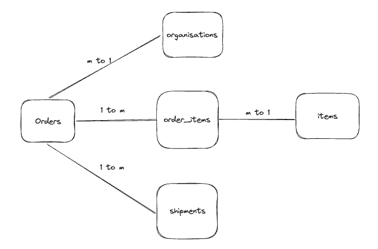

Pair Programming Exercise for Billie
=============


## Implementation summary

1. **Notify Shipment API:**
    - Implemented the `notify-shipment` API to handle shipment notifications.

2. **End-to-End Order and Item Logic:**
    - Added comprehensive logic for handling orders and items from creation to fulfillment.
    - Incorporated dummy data for end-to-end testing to simulate realistic scenarios.

3. **Shipment Logic:**
    - Implemented logic for managing and processing shipments.

4. **New Tables:**
    - Added new database tables to support the extended functionality.

5. **Migration Files:**
    - Included migration files for updating the database schema with new tables and changes.

6. **Tests:**
    - Added tests to ensure the correctness and reliability of the implemented features.
   
=====================================================================================================================


### The Requirements

The way a business like Billie works is this:

```
A business buyer goes to a merchant's e-commerce platform catering and buys goods. 
At the checkout, the buyer chooses Billie as a payment method and checks out via our 
widget on the merchant's site. Upon shipment of the goods, the merchant sends us
the information about the shipped items and is paid immediately.
Depending on the availability of the items the merchant can ship all the items
at once or in separate shipments.
Example: the buyer bought 3 items and the merchant shipped the 1st item the next day
and the 2 other items one week later.
Billie also issues an invoice to the buyer. The buyer is then invoiced by Billie
and they pay the invoice
```

At this point, we have built an API to map simple organizations, but not much else.  
There are a lot of features still to build!!!

### The Exercise

The task is to implement one of the most important business requirements:

> The ability for the merchant to notify Billie of shipment of an order, so they can get paid.
> The merchant is not required to send a list of the shipped items but the sum of the shipments
> should not exceed the total order amount.

In order to implement this, please make a fork of this repo and when done with the implementation, send us a link to
your repo. The time spent on this assignment is usually between 2 and 4 hours. 
If you feel that that wasn't enough please describe in a document what would you add if you had more time.

Strong hint: we are fans of TDD, DDD, and clean code. 
Feel free to change the folder structure or anything else in the project

### The Tech Stuff
#### Prerequisites
We assume that you have docker, docker compose, and Java 15 installed, and can run gradle

Running the tests:
```shell
cd <project_root>
docker compose up database -d
gradle flywayMigrate
gradle clean build
docs at -> http://localhost:8080/swagger-ui/index.html
```
Work has been started but not done yet to containerise the kotlin service.

The service runs in the host right now.  Feel free to fix that if it makes your life easier
